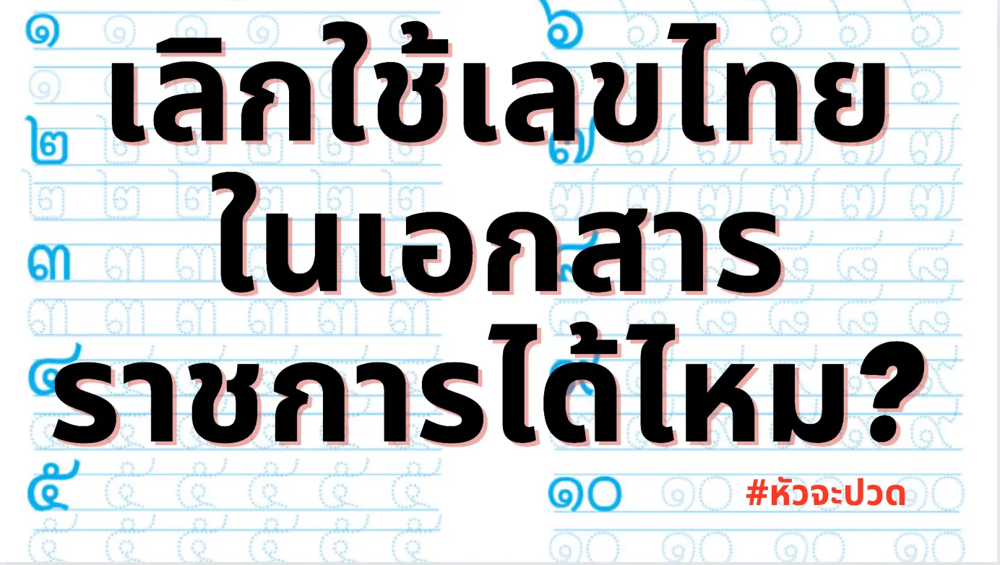

_ของเดิมอยู่ที่ [Facebook Post][-1] เมื่อวันที่ 25 พฤษภาคม 2565 ตอนนี้กลายเป็นแคมเปญบน [change.org][0] ไปแล้ว_

***

หนังสือราชการดิจิทัลใช้เลขไทยตั้งแต่ปี 2000

การใช้เลขไทยในเอกสารดิจิทัลที่เกี่ยวข้องกับตัวเลขเพื่อการคำนวณเป็นการขัดขวางความเจริญของงานประมวลผลเอกสารดิจิทัลด้วยคอมพิวเตอร์ 🧑‍💻 ซึ่งคงต้องได้เวลาที่รัฐจะต้องพิจารณาเปลี่ยนแปลงการใช้เลขไทยให้ถูกที่ ตามวัตถุประสงค์การใช้งาน

เหตุผลการการ “ส่งเสริม” นี้ก็ไม่ได้เริ่มจากการอยากให้ใช้เลขไทยด้วย แต่เริ่มจาก[ข้อสังเกตของ คณะกรรมาธิการศาสนา ศิลปะและวัฒนธรรม สภาผู้แทนราษฎรเมื่อ 16 กุมภาพันธ์ 2543][1] ที่พบว่ามีการใช้ปี ค.ศ. 2000 กันแพร่หลายในหน่วยงานราชการ เช่น ไอที 2000  มหกรรมการศีกษา 2000 เขาก็เป็นห่วงกันว่า หากราชการยอมรับการใช้เลข 2000 แล้ว “...ย่อมจะส่งผลกระทบต่อเอกลักษณ์ของไทยจนกลายเป็นปัญหาที่จะแก้ไขได้ยาก”

ซึ่งตอนนั้นมันปี ค.ศ. 2000 สหัสวรรษใหม่ 🎇 ใครๆ ก็ตื่นเต้นหรือเปล่าวะ...

มันเลยเป็นต้นเหตุคณะรัฐมนตรีก็มี[มติเมื่อวันที่ 2 พฤษภาคม 2543][2] ที่จะ “กำชับ” ให้หน่วยงานใช้ พ.ศ. แทน ค.ศ. แล้วก็แทรกให้ “ส่งเสริม” การใช้เลขไทย เพราะอยาก “...อนุรักษ์ภาษาไทย ซึ่งเป็นภาษาประจำชาติและเป็นสิ่งที่ควรหวงแหน เพราะปัจจุบันภาษาที่เหลืออยู่ในโลกมีไม่มากนัก...” ซึ่งหลังจากนั้นทุกหน่วยงานก็เริ่มใช้เลขไทยในเอกสารดิจิทัล อย่างบ้าคลั่ง เห็นได้จาก[คำบ่นของข้าราชการท่านหนึ่งเมื่อปี 2554][3] 🤷

ผลของการการใช้งานอย่างบ้าไม่บันยะบันยังไม่รู้กาลาเทศะนั้น ทำให้เกิดการใช้เลขไทยที่วิปริตผิดที่ผิดทางในเอกสารราชการกันเป็นอย่างมาก เช่น คำว่า ๕G, Windows ๑๐ หรือแม้กระทั่ง URL ที่ใช้งานไม่ได้จริงเช่น www.๑๒๑๒occ.com

ซึ่งในความเป็นจริง นโยบายการใช้เลขไทยไม่ได้เป็นการบังคับขึ้นอยู่กับแต่ละส่วนราชการ ดังนั้นถ้าอยากให้การประมวลผลข้อมูลดิจิทัลก้าวหน้า หน่วยงานก็เลิกใช้เลขไทยในเอกสารดิจิทัลของราชการกันเถิด 🙇

สิ่งที่น่าสนใจตอนขุดคุ้ยเรื่องนี้คือ ตอนปี 2485 จอมพล ป. พิบูลสงคราม [เคยมีการกำหนดให้เลขสากล (เลขอาหรับ/อารบิค) เป็นเลขไทยมาแล้ว][4] แล้วก็มาโดน[ยกเลิกเมื่อปี 2487][5] โดยนายควง อภัยวงส์ นายกรัถมนตรีในตอนนั้น

ดังนั้นการทำให้เป็นสากลไม่ใช่เรื่องใหม่เขาคิดกันมา 80 ปีแล้ว มันควรจะทำได้ เหลือแค่ต้องทำ

[-1]: https://chng.it/wrtLByW5
[0]: https://www.facebook.com/patipat/posts/10158451353716791
[1]: https://resolution.soc.go.th/PDF_UPLOAD/2543/1367385.pdf
[2]: https://resolution.soc.go.th/PDF_UPLOAD/2543/1367381.pdf
[3]: https://web.archive.org/...//www.opm.go.th/opminter/webbrd/
[4]: http://www.ratchakitcha.soc.go.th/.../2485/D/073/2905.PDF
[5]: http://www.ratchakitcha.soc.go.th/.../2487/A/068/1042.PDF
